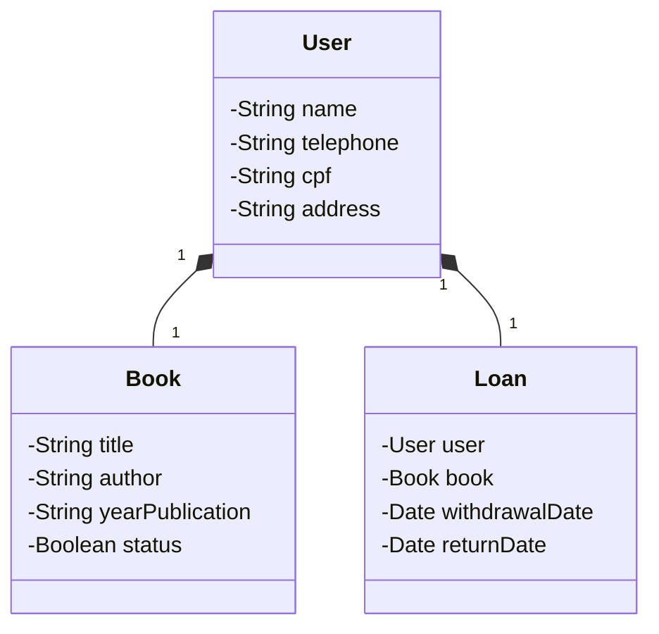

# App library desafio DIO API REST com spring boot

## Diagrama de Classes

```mermaid
classDiagram
  class User {
    -String name
    -String telephone
    -String cpf
    -String address
  }
  class Book {
    -String title
    -String author
    -String yearPublication
    -Boolean status
  }
  
  class Loan {
    -User user
    -Book book
    -Date withdrawalDate
    -Date returnDate
  }

  User "1" *-- "1" Book
  User "1" *-- "1" Loan
```

